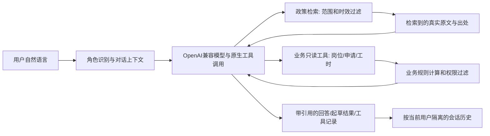

# AI 服务助手（v0.3）

## 怎么体验

启动“青禾”后，登录任一角色，左侧点“AI 服务助手”。欢迎区的问题卡按角色提供示例；点卡片即可发送，也可以直接输入。回答标为“AI 回答”时本轮使用了模型；标为“原文与业务查询”时则由本地检索/业务逻辑返回。展开“实际查询与执行记录”查看本轮真实工具和权限拒绝，展开“查看原文依据”核对资料号、范围、限制和官方链接。

学生可问政策、自然语言找岗、申请进度、本人月度工时与薪酬，或要求润色申请理由。单位只能查本单位岗位、申请与工时，可起草招聘文案。资助中心可查官方资料和授权范围内汇总。管理员可查看汇总与维护模型。助手只读业务数据，不提交申请、不审批、不登记工时，也不认定困难等级；AI 草稿需人工核对并在原业务页面确认。

想要真实大模型回答：管理员点“AI 模型配置”，选择“DeepSeek Flash”，确认默认基础地址 `https://api.deepseek.com` 与模型 ID `deepseek-flash`，填写本人获得的 API 密钥，保存，再点“测试已保存的连接”。通过后回到 AI 助手。当前项目不附赠服务商密钥，也没有预置可用模型凭据；未配置时本地原文和业务查询仍可体验。

更换模型时选服务商并核对其当前官方控制台的基础地址、模型 ID 和同地域要求，填写新密钥后保存、测试。改到不同服务商地址时，不会把上一个密钥自动带过去。AI 设置 GET 接口不返回密钥；测试只发送固定问候。远程对话会发送问题及完成回答需要的政策摘录、模拟岗位信息或本人/本单位汇总。原型阶段只用模拟账号和数据，不提交真实学生个人信息。免费模型路由不保证稳定速度、具体模型、调用额度或长期免费。

## AI 设计

模型负责理解用户表达、把口语改写为工具参数、决定何时查资料/业务、综合解释和起草文本。模型不能选择身份或数据库用户 ID，服务端从登录令牌确定权限。工具只读，SQL 查询及薪酬公式始终由后端现有规则执行。政策检索先按学校/国家、年份、资料用途、发布日期、实施日期和截止日期过滤，再按主题词、条款号和正文匹配官方原文段落；模型回答附可展开出处。学校当前细则缺失、过期招聘和劳动标准混用等情况走确定性边界说明。

当前知识检索为可解释的主题词/词项检索与原文片段排序，并将检索结果交给 LLM 形成 RAG 问答；尚未实现向量嵌入、Chroma 或其他向量数据库。设计报告不能写成“已完成向量检索”或“知识库自动学习”。

模型超时、接口返回异常、工具参数无效或模型遗漏关键业务查询时，会回退到原文/业务结果并标清模式。知识缺口或数字无法对回真实原文时不会采用模型数字。岗位匹配分与应结算金额由既有业务规则算出，模型负责解释。AI 的 tool calling 不能执行申请、审批、工时修改或困难认定。

## 答辩演示顺序

1. 用学生示例询问“武汉设计工程学院勤工助学一周能做几小时”，展开教育部 S08 第二十一条原文，解释学校/国家范围。
2. 问“学校当前具体时薪是多少”，展示公开资料缺口和咨询渠道；明确劳动最低工资不是本校勤工标准。
3. 问“我周一下午有空，会 Excel，帮我找适合岗位”，展示模型的自然语言理解、岗位只读工具、匹配卡和规则分数说明。
4. 问“查看我2026-09的工时与薪酬”，展示系统核算正常126元、待核75元；追问“那我能拿多少钱”，展示同一对话月份上下文与待核金额不混算。
5. 用单位账号问“帮我起草学生助理招聘文案，酬金和截止日期待确认”，展示模型文案草稿；确认发布仍回到岗位表单。
6. 切换 DeepSeek / 百炼等模型或关闭模型，展示不同 provider 可配置、每条回答如实标识实际模式。

只将第 1、2 项原文证据和系统中的演示数据作为当前已验证内容。在线模型质量、工具格式兼容和答案效果应使用用户自己的服务密钥试用后记录实际结果；mock 测试只验证协议和边界，不等于在线模型实测。
