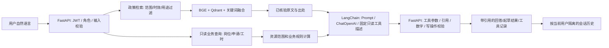

# AI 服务助手（v0.3 · LangChain 受控 RAG）

## 怎么体验

启动“青禾”后，登录任一角色，左侧点“AI 服务助手”。欢迎区的问题卡按角色提供示例；点卡片即可发送，也可以直接输入。回答标为“AI 回答”时本轮经 LangChain 调用模型；“模型降级为原文/规则”表示模型异常或校验失败后的安全回退；“无可靠依据”表示资料缺口拒答。展开“实际查询与执行记录”查看本轮真实工具和权限拒绝，展开“查看原文依据”核对资料号、范围、限制和官方链接。

学生可问政策、自然语言找岗、申请进度、本人月度工时与薪酬，或要求润色申请理由。单位只能查本单位岗位、申请与工时，可起草招聘文案。资助中心可查官方资料和授权范围内汇总。管理员可查看汇总与维护模型。助手只读业务数据，不提交申请、不审批、不登记工时，也不认定困难等级；AI 草稿需人工核对并在原业务页面确认。

想要真实大模型回答：管理员点“AI 模型配置”，核对服务商、接口和模型ID，填写本人获得的API密钥，保存，再点“测试已保存的连接”。项目不附赠服务商凭据，新机器须自行配置。未配置回答模型时，本地语义原文和业务查询仍可体验。

更换模型时选服务商并核对其当前官方控制台的基础地址、模型 ID 和同地域要求，填写新密钥后保存、测试。改到不同服务商地址时，不会把上一个密钥自动带过去。AI 设置 GET 接口不返回密钥；测试只发送固定问候。远程对话会发送问题及完成回答需要的政策摘录、模拟岗位信息或本人/本单位汇总。原型阶段只用模拟账号和数据，不提交真实学生个人信息。免费模型路由不保证稳定速度、具体模型、调用额度或长期免费。

## AI 设计

模型负责理解用户表达、提出固定工具的查询意图、综合解释和起草文本。模型不能选择身份或数据库用户 ID，服务端从登录令牌确定权限。LangChain 不执行业务工具：它只使用固定工具描述将模型调用结果带回 FastAPI；FastAPI 再以 Pydantic、身份、资源范围和白名单决定是否执行只读查询。SQL 查询及薪酬公式始终由后端现有规则执行。政策/规则/工资标准/历史招聘/报名条件/学校细则问题先强制经过 `policy.py` 的学校/国家、用途、历史、时效和劳动最低工资过滤，不能因关键词遗漏转到模拟岗位。政策事实直接展示可展开的已核验原文和确定性边界，不把带有合法 `[1]` 的模型自由结论误称为已验证。学校当前细则缺失、过期招聘和劳动标准混用等情况走资料缺口或边界说明。

2026-10-04模型可用时已真实接入 LangChain：`ChatPromptTemplate` 组织系统提示、已脱敏历史和带出处证据，`ChatOpenAI` 适配管理员配置的 OpenAI 兼容接口，固定只读工具 schema 仅让模型提出查询请求。知识检索继续使用 FastEmbed 加载 `BAAI/bge-small-zh-v1.5`，将原文按条款和重叠片段编码为 512 维向量，存入 Qdrant 本地索引。先按学校/国家、时效与资料用途过滤，再融合关键词和余弦相似度排名；政策问题的最终事实展示仍由服务端原文摘录决定。确切条款编号继续直接定位原文。Qdrant health check 会核对 collection、维度、实际点数与 manifest 片段数，并在这些检查或语义查询异常时显示不可用、明确回退到关键词检索；它不宣称可检测任意存储损坏。完整操作及验证见`RAG.md`；不应写成知识库自动学习、模型训练或可写自主 Agent。

模型超时、接口返回异常、工具参数无效或模型遗漏关键业务查询时，会回退到原文/业务结果并标清“模型降级为原文/规则”。固定/临时岗位的自然语言薪酬问法先检索已核验政策；本校具体酬金没有可靠依据时显示资料缺口，不把模拟岗位工资当学校或国家政策。政策问题即使模型文字看似合理，也只显示已核验原文和确定性边界。岗位匹配分与应结算金额由既有业务规则算出，模型负责解释。模型回答阶段单独检查申请/撤销、审批、岗位发布/关闭、确认/安排上岗、结束/终止、工时登记/更正/核实、困难认定和角色权限调整等执行声明；无法由本轮只读结果支持的声明替换为“本次未执行写入，请到对应页面人工确认”。本轮只读结果能够证明岗位已关闭/结束时允许保留状态说明；确定性工具回答不经过模型声明拦截。

同一会话的模型历史与追问上下文只在当前服务已完成连接验证，且紧邻上一条回答记录也带有当时已验证标记、服务商、规范化接口地址和模型 ID 与当前值完全一致时才会进入下一次模型编排；该标识不包含 API 密钥。升级前没有该验证标记的旧记录也不复用。即使之后切回旧服务，也不会跨越中间不同服务记录转发更早对话。离线回答、模型降级回答、未验证服务、切换服务商或同一接口下的不同模型均不转发旧回答，也不复用前一轮政策/业务追问上下文。此时“那我能拿多少钱”这类模糊薪酬追问会要求明确月份。

## 答辩演示顺序

1. 用学生示例询问“武汉设计工程学院勤工助学一周能做几小时”，展开教育部 S08 第二十一条原文，解释学校/国家范围。
2. 问“学校当前具体时薪是多少”，展示公开资料缺口和咨询渠道；明确劳动最低工资不是本校勤工标准。
3. 问“我周一下午有空，会 Excel，帮我找适合岗位”，展示模型的自然语言理解、岗位只读工具、匹配卡和规则分数说明。
4. 问“查看我2026-09的工时与薪酬”，展示系统核算正常126元、待核75元；追问“那我能拿多少钱”，展示同一对话月份上下文与待核金额不混算。
5. 用单位账号问“帮我起草学生助理招聘文案，酬金和截止日期待确认”，展示模型文案草稿；确认发布仍回到岗位表单。
6. 切换 DeepSeek / 百炼等模型或关闭模型，展示不同 provider 可配置、每条回答如实标识实际模式。

本次已完成MiMo配合真实本地向量检索的工时、培训及学校时薪缺口样例，结果见`acceptance/rag-live-agent-2026-10-03.json`。其余模型的质量、工具格式兼容和答案效果需分别实际验证；mock测试只验证协议和边界，不等于在线模型实测。
