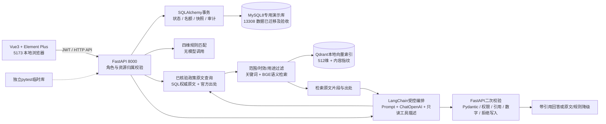
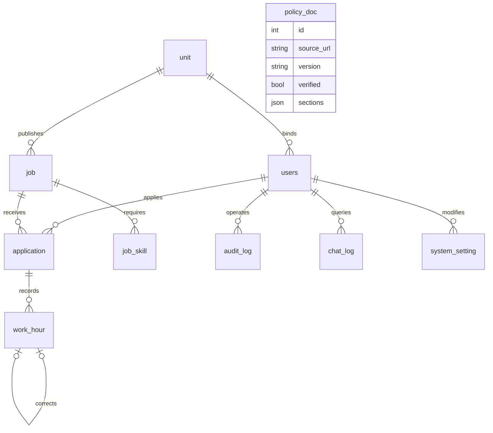
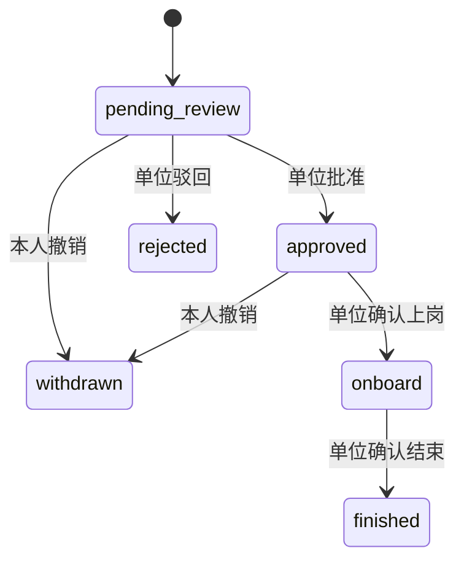

# 架构与规则解释

工时当前链尾按“日期 / 原始创建时间 / 原始ID”排序，在学生跨岗位范围计算周/月前缀；任一超限，整条进入待核。核实绑定当前链尾，更正重新核实。旧记录不重复相加。

临时岗 F(H)=H×冻结时薪；固定岗 F(H)=min(H,40)/40×冻结月薪基准。正常=F(正常有效H)，待核=F(正常H+待核H)−F(正常H)。每组未舍入结果先汇总，最后ROUND_HALF_UP保留两位。

总匹配分=(40T+25D+25K+10L)/100。T按合并时段交集分钟；D为确认后的0/50/100演示映射；K精确词表命中；L同区100/相邻70/跨两区40。缺资料不生成总分；空技能列表有效。附录A黄金72/80/null与并列101、103、102已自动测试。

所有匹配权重、困难映射、工资折算、名额批次和异常核实流程是原型约定；教育部条款有独立原文来源，不把模拟算法写成学校制度。

AI/RAG 的准确表述是：**LangChain 编排受控 RAG 与只读工具；FastAPI 执行权限和业务规则；BGE + Qdrant 完成语义检索。** LangChain 不拥有数据库写入权限，也不能绕过 JWT、Pydantic、资源范围、政策适用范围、引用和数字校验。SQL 政策原文与元数据是权威来源，Qdrant 仅为可重建派生索引；collection 缺失、损坏或不可打开时，状态显示不可用并走关键词降级。系统保持线性、可审查的受控编排，固定 21 题开发集的检索结果不等同于通用 AI 准确率。
